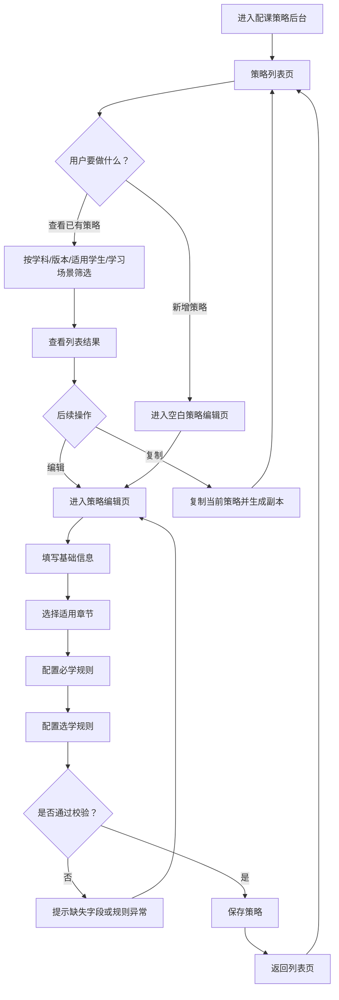
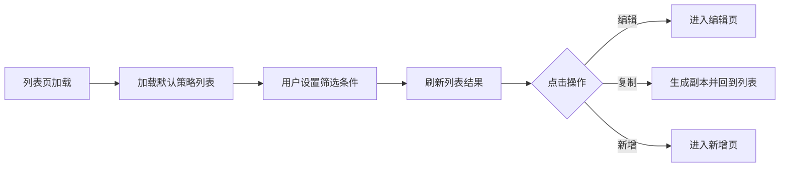
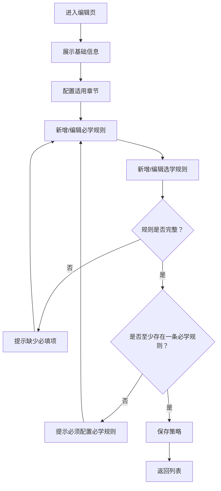
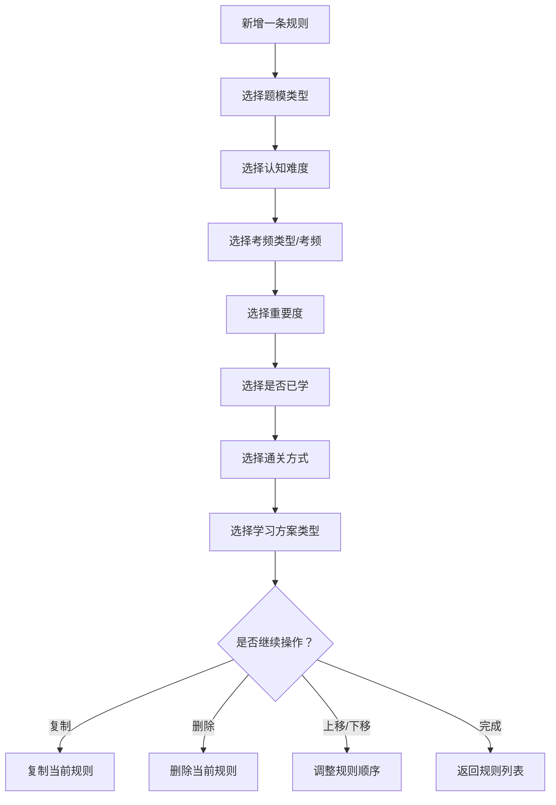

# 配课策略后台管理流程图

## 1. 功能逻辑总览

配课策略后台管理的核心逻辑可以概括为：

1. 先找到策略
2. 再创建或编辑策略
3. 再配置章节和规则
4. 再完成校验与保存
5. 最终回到策略列表供后续复用、复制和维护

这套后台并不是简单“填表”，而是承接机器配课规划的上游规则生产平台，因此需要同时满足：

- 策略可查找
- 规则可配置
- 逻辑可复用
- 配置可校验
- 结果可维护

---

## 2. 总体流程图

---

## 3. 关键子流程

## 3.1 列表页逻辑

### 说明

- 列表页是策略后台的主入口
- 核心目标不是展示所有细节，而是帮助用户快速找到目标策略
- 这里最重要的能力是：筛选、查看、编辑、复制、新增

---

## 3.2 编辑页逻辑

### 说明

- 编辑页是最核心的生产页面
- 页面必须围绕“策略结构化生产”设计，而不是单纯字段堆砌
- 必学规则优先级高于选学规则，因此保存前必须至少存在一条必学规则

---

## 3.3 单条规则配置逻辑

### 说明

- 一条规则本质上是在定义“什么学生、面对什么内容、用什么方式学”
- 规则顺序非常重要，因为必学/选学下可能存在多条策略组合
- 后台需要明确支持：新增、复制、删除、上下移动

---

## 4. 页面职责拆解

## 4.1 策略列表页职责

- 负责查找和管理策略
- 负责承接新增入口
- 负责承接编辑和复制动作

## 4.2 策略编辑页职责

- 负责配置一条主策略
- 负责配置章节范围
- 负责配置必学与选学规则
- 负责保证规则完整性与可保存性

## 4.3 单条规则卡片职责

- 承载规则字段填写
- 承载规则顺序调整
- 承载规则复制和删除

---

## 5. 交互设计原则

为了保证后台策略平台可用，原型设计时建议遵循以下原则：

### 5.1 列表页以“快速定位”为核心

- 筛选区固定在顶部
- 列表字段信息足够支撑快速决策
- 操作尽量短路径完成

### 5.2 编辑页以“分区明确”为核心

- 基础信息、章节策略、必学规则、选学规则明显分区
- 每个区块职责清晰，避免视觉上混在一起

### 5.3 规则配置以“结构清楚”为核心

- 单条规则采用卡片化呈现
- 字段分组要符合策略思维顺序
- 操作项集中在右侧或底部，减少来回跳转

### 5.4 保存前以“校验友好”为核心

- 缺少字段时要明确指出哪一条规则、哪个字段未完成
- 不要在保存失败时只给通用报错

---

## 6. 原型输出建议

基于以上逻辑，后台策略管理交互原型建议至少覆盖以下页面和状态：

### 6.1 列表页

- 默认列表状态
- 筛选后状态
- 复制成功后的状态

### 6.2 编辑页

- 编辑已有策略状态
- 新增空白策略状态
- 新增规则后的状态
- 校验失败提示状态

### 6.3 规则操作状态

- 复制规则
- 删除规则
- 上移/下移规则

---

## 7. 对应交互原型

本流程图对应的交互原型文件：

- [配课策略后台管理交互原型-v2.html](/Users/mac/Desktop/精准学说明文档-md/配课策略后台管理交互原型-v2.html)
