机器配课逻辑及操作说明
# 机器配课操作要求（面向学科老师）
随着机器配课功能的不断优化，多项实用功能受到老师们的认可。目前文科多个版本均计划切换至机器配课，为更好地适配这一系统，请相关学科老师提前完成以下内容的准备工作。建议全部阅读掌握机器配课要求后开始操作。
教研平台链接：https://ijiaoyan.aixuexi.com/knowledge-graph.html#/resources-search-by-knowledge
教研平台说明文档：教研产品手册-汇总
精准学管理后台链接：https://admin.aixuexi.com/#/sub-projects/jzx-backend/designPlanRule
导学端说明文档：学习地图-帮助文档
有疑问可在文档中评论，后续持续补充
# 内容生产（教研平台）
## 章节序创建
严格按照章—节—元—模四层结构创建章节序
启用地区本 功能介绍：图谱如何支持-学习本地化
下图章—节—元—模四层结构符合要求
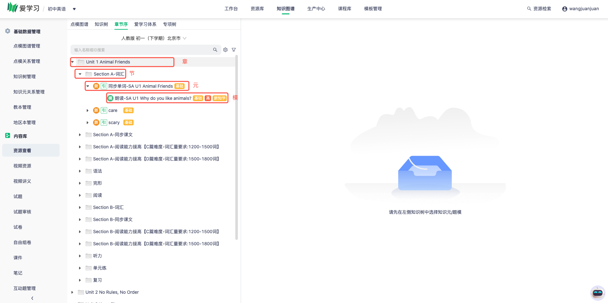
下图只有三层结构，不满足要求
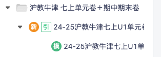
精准学新老系统共用一套章节序，在内容展示上有差异，机器配课只展示对应方案下内容，跟策略有关，老系统展示模下所有资源。如下图。
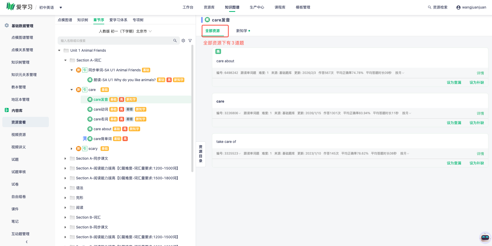
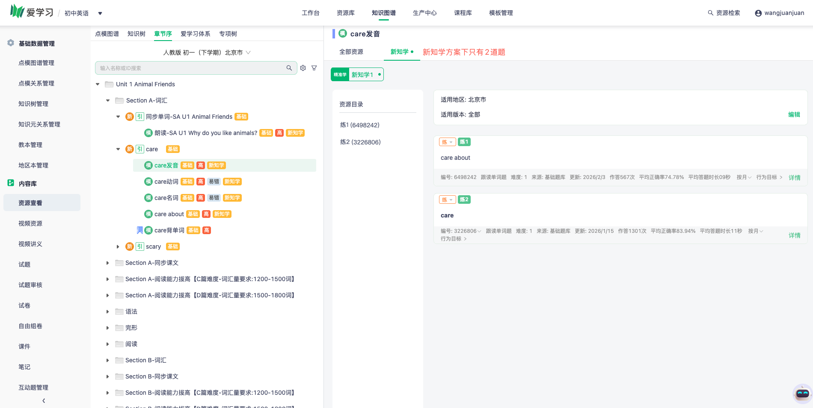
注意事项：
跟机器配课无关的章节序请删除，冗余的章节序内容会导致教研及精准学系统的卡顿等
单个章节序下章的数量不超过24个（超过的章节学生端无法显示），单个章下节的数量尽量不超过10个，单个节下元的数量尽量不超过10个
## 方案创建
模下需要创建新知学或巩固学等方案操作手册-模学习方案
方案内可放置海绵（视频）、快问快答、普通题目、交互学（启发学）等资源
方案需要发布（红色表示未发布）
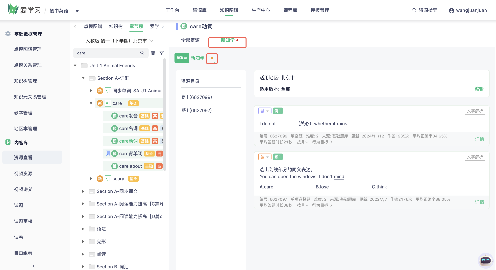
如果要使用测学模式，需要设置前测题
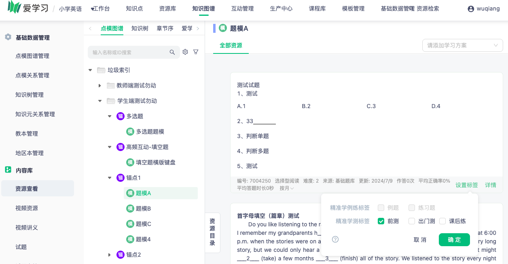
学、试、练标签（文科目前不需要试错题，不需要设置）
在精准学的学习方案中，根据资源类型默认学习标签，支持切换。
海绵视频默认为学，不可切换
启发学和交互学，默认为学。可以切换到【试】，学和试可以相互切换
快问快答。默认为试。可以切换到【练】，试和练可以相互切换。
试题根据使用类型区分：
当题目作为例题使用时，默认为试。试和练可以相互切换。
当题目作为练习题使用时，默认为练。试和练可以相互切换。
当题目作为普通题使用时，普通题默认为练。试和练可以相互切换。
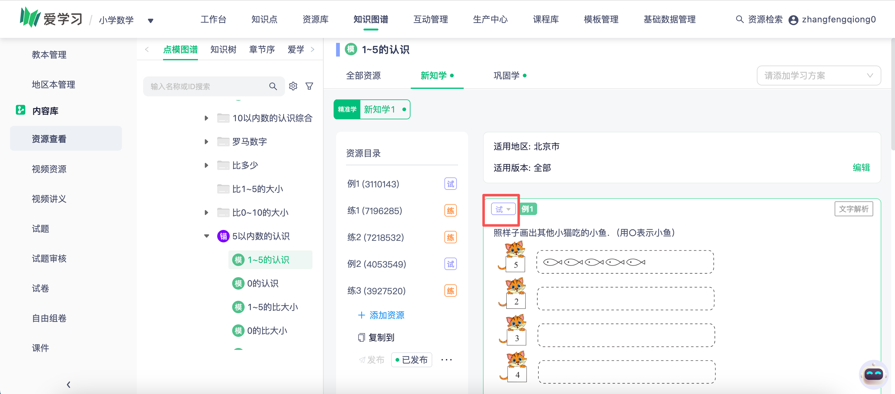
## 标签管理
### 模标签
模标签会影响配课策略中选择哪些内容，使用何种学习方法，选择何种学习方案。目前机器配课策略需要的标签包含：难度、重要度、章节/期中/期末等考频，具体需要用到哪些由学科老师自行判断。题模属性精准学使用关系
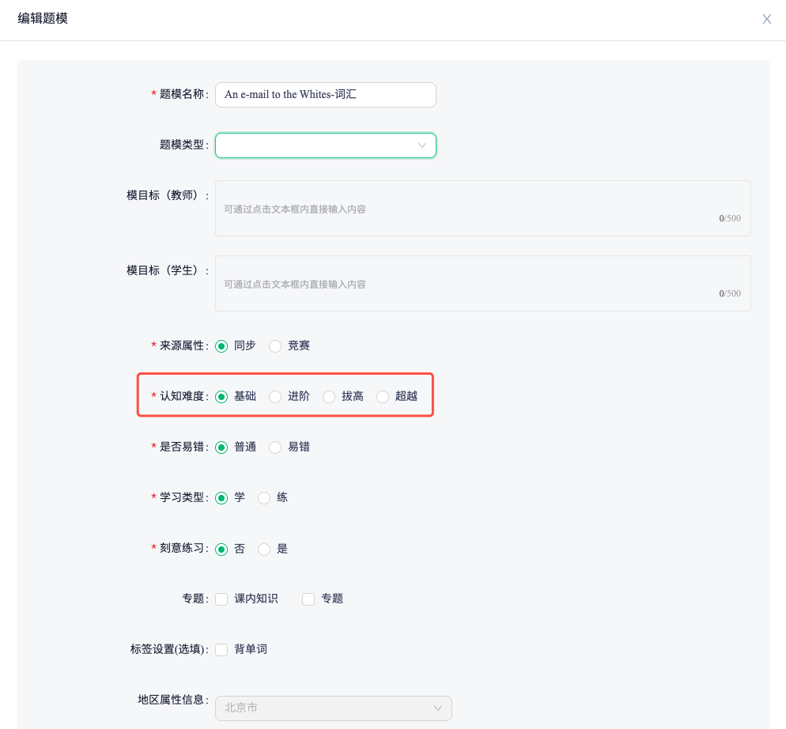
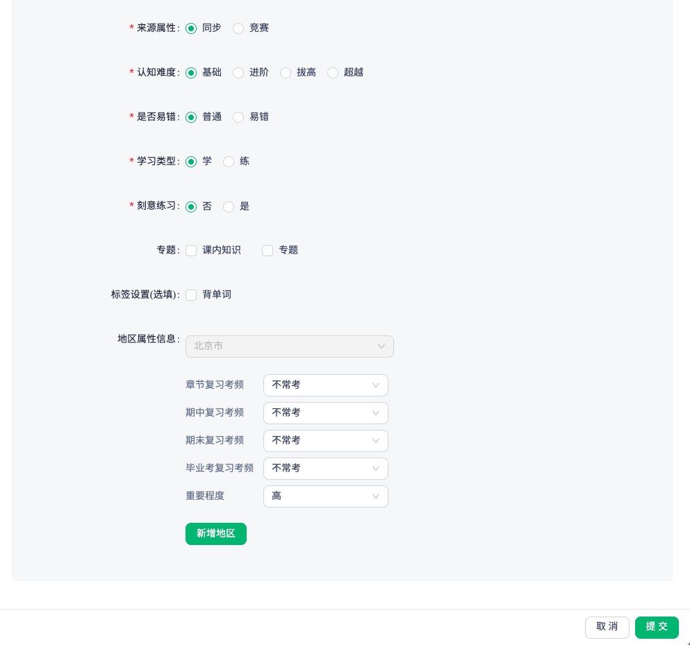
### 元标签
元标签会影响导学端的展示位置和学生端的学习顺序。同一节下，先学完基础元，再学进阶元，最后学拔高及超越元。
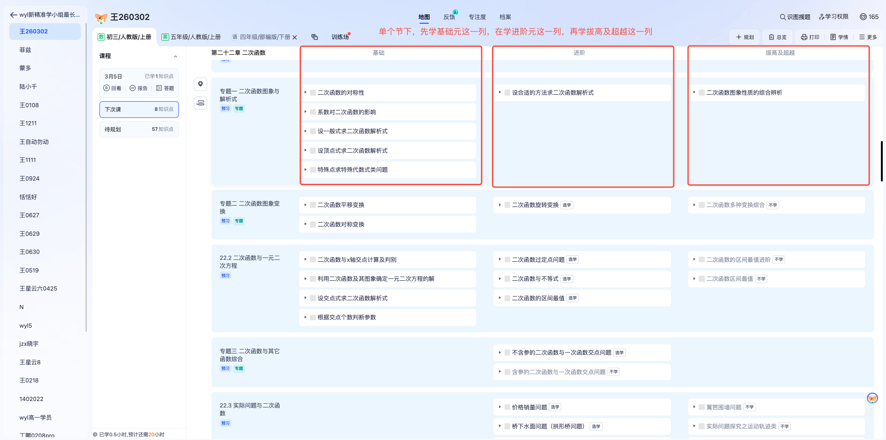
注意：
部分标签具备地区属性，设置时需要注意。
## 题库管理
### 题目
除了方案内设置的题目，在课后也可以给学生布置方案外的题目作为作业，需将题目放在题模下教研产品手册-题库
导学端题目位置：
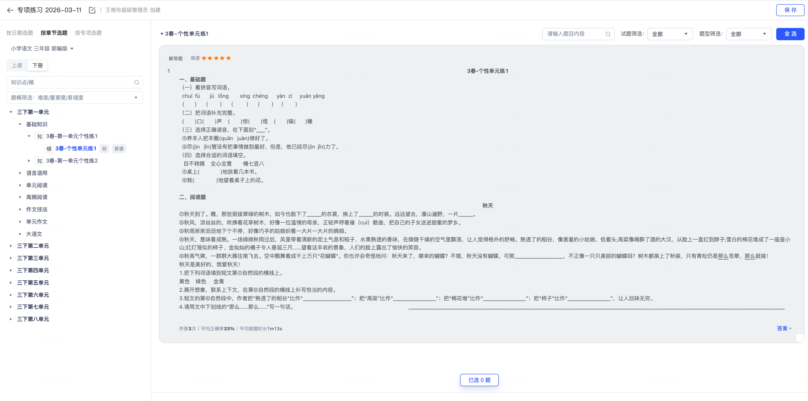
### 试卷
自定义组卷和真题试卷会出现在导学端训练场教研产品手册-题库
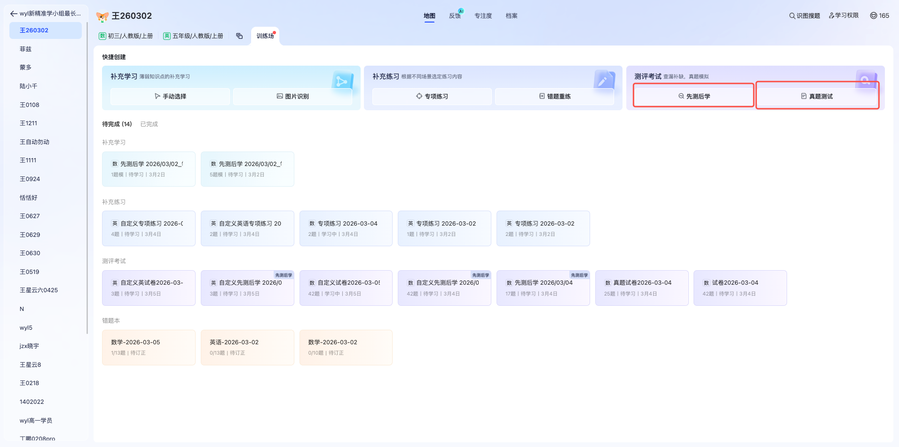
注意：
精准学题库题目要求：同时满足已校对和选入jzx，否则无法在导学端呈现
试卷题库要求：选入jzx
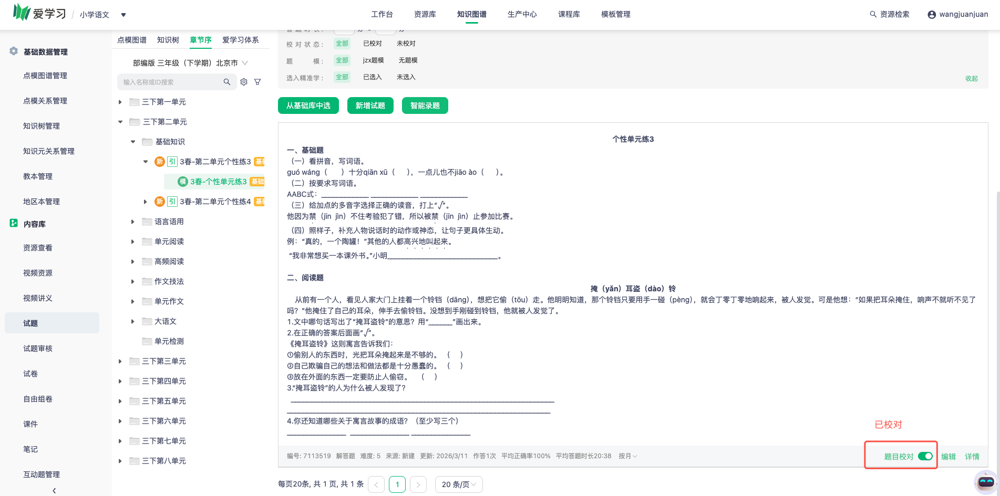
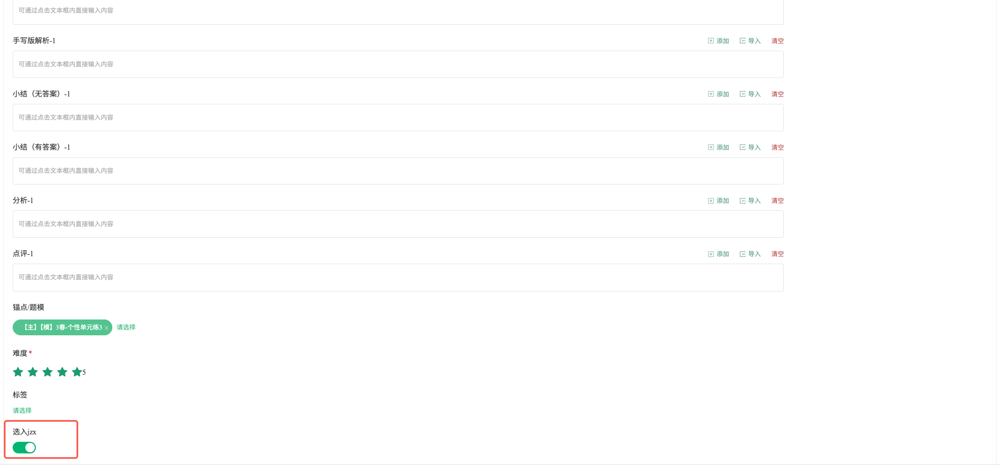
# 策略管理及配置（精准学后台）
⚠️以下内容仅做了解，后续会线下培训，培训前请勿操作以防影响线上使用！需要提供策略表格
## 配课策略管理
什么是配课策略：配课策略决定了在不同场景下，不同分层的学生，针对哪些章节的哪些模，用何种学习方式学习。
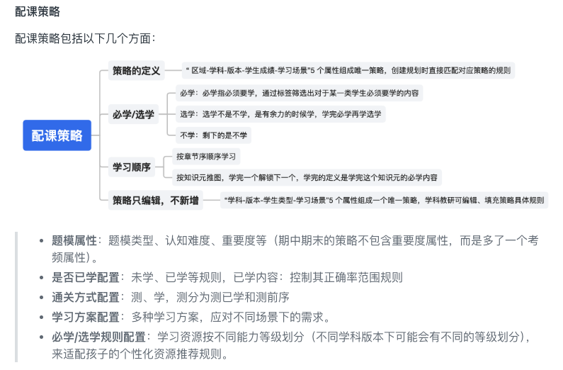
首先需要考虑如何设置策略：
确定学生分层，各学科不一致
策略设置：确定不同学生分层下不同场景下的策略
必学/选学内容有哪些（圈定模范围）：通过章范围、题模标签、是否已学、正确率等筛选出必学题模，部分标签为必填。
筛选出来以后选择学习方式：
学、测学（测已学、测前序、先测后补）
选择哪种方案：新知学、巩固学等
例1：【必学：基础—高，学-新知学】，表示难度标签为基础，重要度标签为高的题模为必学，学习方式为学，学习的方案为新知学方案
例2:【必学：基础—高，区分已学-是，正确率<60%，测学-巩固学】，表示难度标签为基础，重要度标签为高，且学生已经学过的题模中正确率<60%的题模为必学，学习方式为测学，测错后学习的方案为巩固学方案
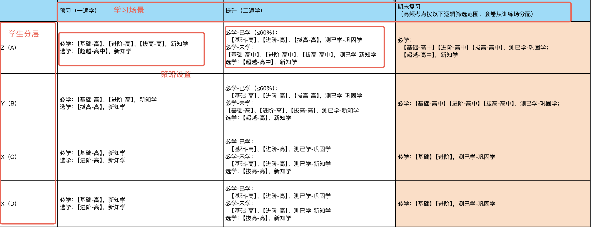
设计好策略后，在后台进行配置：
可以通过筛选看是否已经创建策略，如果没有在右上角新建，新建的时候选择学科&版本后，同时创建出多条策略
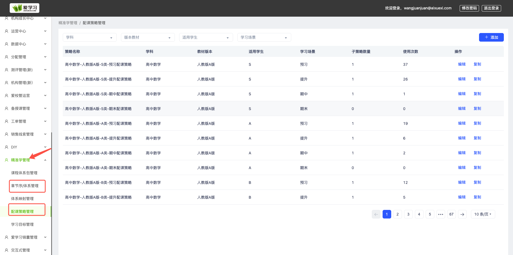
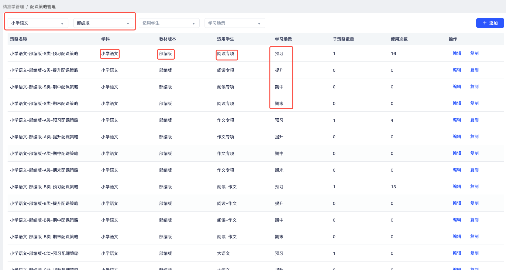
编辑具体的策略：
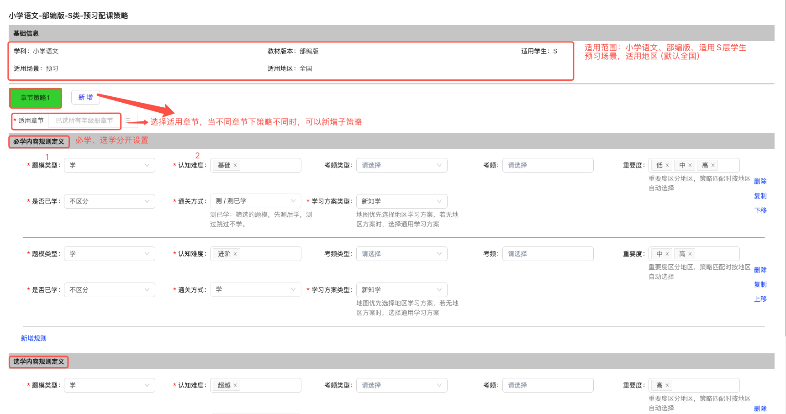
题模类型、认知难度、考频类型&考频、重要度、是否已学共同确定题模范围，通关方式和学习方案类型确定学习方式
必学、选学需要分别设置，其他的自动归为不学
必学/选学下可以设置多条策略（以上图为例，必学下的第一条策略针对基础—低中高，第二条策略针对进阶—中高）
便捷操作：删除、复制、上下移动
## 定向输出管理
为什么有定向输出：新建一个章节序是给某些机构使用的，定向输出同时对新老系统生效
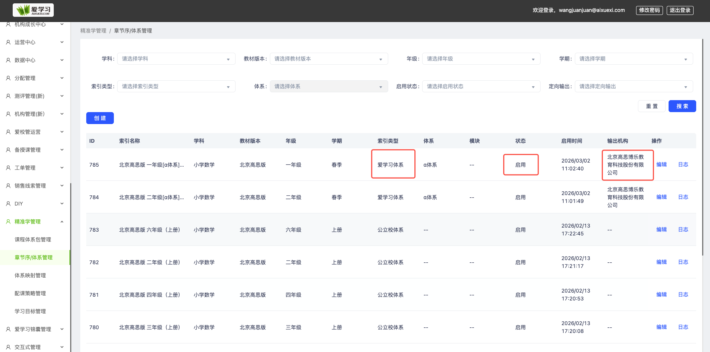
索引类型：机器配课用的是公立校体系
状态：启用后才可给机构使用
输出机构：点击编辑，可选择是否定向输出，选择是，那该章节序只有输出机构可使用；选择否，全部机构可见。注意：输出时，新老系统同时生效。
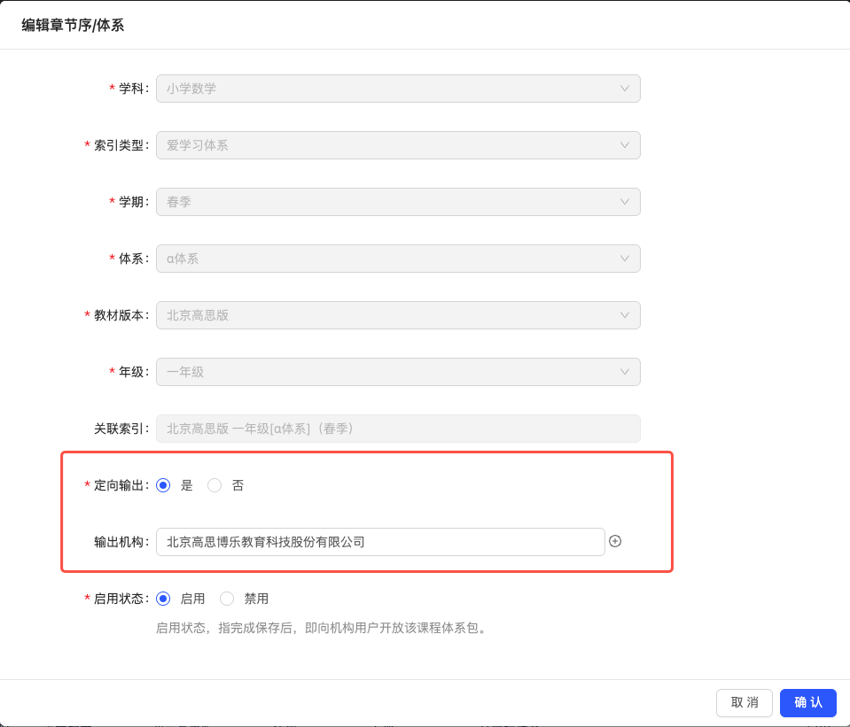