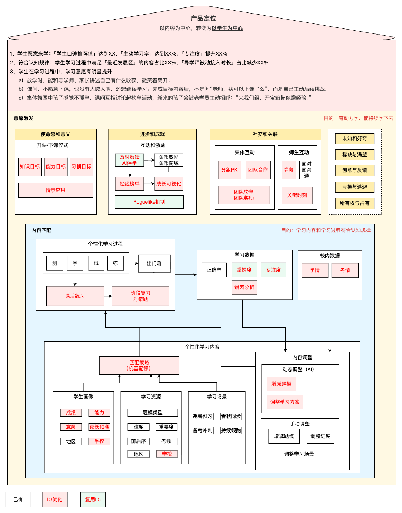

# 精准学产品架构讨论
2026/3/2, V0.1，初版作成
# 战略定位
以内容为中心转变为以学生为中心
# 总纲
人机交互为核心、导学师提供增益非必要价值
# 产品架构
## 产品架构图
基于L3的场景特点（线下集体交付），以学生意愿、内容匹配为出发点进行拆解

## 2-“内容匹配”的拆解
### 核心思路
思路：基于学生能力、意愿和知识掌握状况，找到学生的“就近发展区”，制定相应的学习策略，既能符合认知规律、也能让孩子有学习意愿。
既不过于简单导致枯燥，也不过于困难产生挫败。以学生自身的能力、意愿标签，找到适配的学习内容和学习方式。
## 2-“内容匹配”方向
构建学生画像标签：每个学生建立实时的能力和意愿画像，通过系统自动采集行为数据生成标签，导学师验证补充。
内容匹配策略：基于标签、场景为学生匹配合适的内容难度（基础/进阶/拔高）和学习方案（通过视频还是互动，练习几道题）
动态调整：根据学生实际学习的数据，始终保证难度和方案适配
不同学生设计的不同解决方案
基于学生能力、意愿和知识掌握状况，制定相应的学习策略，既能符合认知规律、也能让孩子有学习意愿。
什么是成绩等级：优秀（校内95分以上）；中等（70-95）；后进（70以下）
什么是学习能力：理解、吸引、应用、迁移的能力，体现在知道知识是什么、不死机硬背；会抓重点、会归纳；学了能用、会解决问题。学习能力更像方法、智力更偏硬件底子。 学习能力强，指针对校内学习能力有溢出的。
什么是学习意愿：内心的动力，我想学、我愿意学，体现在自己主动学、觉得有意思、遇到困难不逃避。
# 

| 学习体系 | 学生特征 | 核心诉求 | 学习策略 | 典型案例 |
| --- | --- | --- | --- | --- |
| 校内同步 （含浅奥） | 【优等生/优潜生】 成绩优秀/中等、学习能力强、学习意愿强 | 提升见识，每次考试成绩稳定 | 寒暑：提前预习下学期重点“认知增量（基础、进阶）”和基础题型。定期消错题和错题分析，做计算等相关的基本功练习。 春秋：尽量走在学校前面。已预习（准确率低于100%）的测学，没预习的：认知增量直接学（含拓展拔高）；题型类的测学。定期消错题和错题分析。章节复习做单元套卷和查漏补缺，期中期末复习做套卷、汇编、复习高频考点。 | 白翘楚 |
|  | 【努力的中等生】 成绩中等、学习能力弱、学习意愿强 | 能力逐步提升，大考成绩变化 | 寒暑：提前预习下学期重点“认知增量（基础）”和基础题型。做计算等相关的基本功练习，定期消错题和错题分析。 春秋：尽量走在学校前面。已预习（准确率低于90%）的测学，没预习的认知增量直接学；题型类的测学。定期消错题和错题分析。章节复习做单元套卷和查漏补缺，期中期末复习做套卷、汇编、复习高频考点。 | 恩沐 |
|  | 【意愿不足的中等生】 成绩中等、学习能力强、学习意愿弱 | 快速看到成绩变化，开学第一次考试成绩达到预期，通过成绩变化调动意愿 | 寒暑：提前预习下学期重点“认知增量（基础、进阶）”。做计算等相关的基本功练习。 春秋：尽量走在学校前面。已预习（准确率低于90%）的测学，没预习的认知增量直接学；题型类的测学。定期消错题和错题分析。章节复习做单元套卷（选做部分）和查漏补缺，期中期末复习做套卷、汇编、复习高频考点。 | 添爱 |
|  | 【薄弱的中等生】 成绩中等、学习能力弱、学习意愿弱 | 快速看到成绩变化，开学第一次考试成绩达到预期，通过成绩变化调动意愿 | 寒暑：提前预习下学期重点“认知增量（基础）”。做计算等相关的基本功练习。 春秋：尽量走在学校前面。已预习（准确率低于90%）的挑重点（掌握度、考频）来测，没预习的直接学。校内已考的、根据校内考情跳过检测直接学。定期消错题和错题分析。章节复习做单元套卷（选做部分）和查漏补缺，期中期末复习做套卷、汇编、复习高频考点。 | 武一诺 |
|  | 【后进生】 成绩差、学习能力弱、学习意愿弱 | 快速看到成绩变化，开学第一次考试成绩达到预期，通过成绩变化调动意愿 | 寒暑：提前预习下学期重点“认知增量（基础）”、上学期的漏洞。做计算等相关的基本功练习。 春秋：尽量走在学校前面。已预习（准确率低于80%）的挑重点（掌握度、考频）来测，没预习的直接学。校内已考的、根据校内考情跳过检测直接学。定期消错题和错题分析、补前序。章节复习做单元套卷（选做部分）和查漏补缺，期中期末复习做套卷、汇编、复习高频考点。 | 妙熙 |
| 独立体系 | 【优等生】 成绩优秀、学习能力强、学习意愿强 | 取得竞赛成绩，拼点招机会；拓展思维，理科成为强势学科 | 按高思导引（大纲）的顺序推图第一遍学（匹配学生水平），定期消错题。根据学生偏好，选择多看视频、还是多做题。 每6-7次课之后做阶段复习，按学习目标做二遍学（测学）。 平时课后练：导引真题+学习内容定制练+定期消错题 备考前练导引真题、练真题卷。仅优秀孩子推荐参加竞赛 | 汪含章 |
|  | 【意愿不足的优等生】 成绩优秀、学习能力强、学习意愿弱 | 激发学习意愿，坚持学下去，成为优势学科 | 按高思导引（大纲）的顺序推图第一遍学（匹配学生水平低一点），定期消错题。根据学生偏好，选择多看视频、还是多做题。 每6-7次课之后做阶段复习，按学习目标做二遍学（测学）。 建议课后练导引真题 备考前练导引真题、练真题卷。仅优秀孩子推荐参加竞赛 | 目前北京不存在。JZX会调整到混合体系 |
| 混合 | 【优等生】偏奥数 成绩优秀、学习能力强、学习意愿强 | 有机会冲刺竞赛成绩，同时能保证校内领先 | 按高思导引（大纲）的顺序推图第一遍学（匹配学生水平），定期消错题。根据学生偏好，选择多看视频、还是多做题。 每6-7次课之后做阶段复习，按学习目标做二遍学（测学）。 平时课后练导引真题 期中期末复习做套卷、汇编、复习高频考点 | 王储修 |
|  | 【优等生】偏校内 成绩优秀、学习能力强、学习意愿强 | 能保证校内领先的同时，开拓思维、小初高贯通培养 | 不学没用的奥数，只学对初高有用的奥数 寒暑：提前预习下学期重点“认知增量（基础、进阶）”，学完之后学高思导引的重点章节。 春秋：章节复习做单元套卷和查漏补缺，期中期末复习做套卷、汇编、复习高频考点。剩下时间按高思导引的重点章节顺序推图，每6-7次课之后做阶段复习，按学习目标做二遍学（测学）。 | 梓馨 |
|  | 【不稳定的中等生】偏校内 成绩优秀/中等、学习能力强、学习意愿弱 | 在稳定校内成绩的同时，开拓思维、小初高贯通培养 | 寒暑：提前预习下学期重点“认知增量（基础、进阶）”和基础题型。定期消错题和错题分析，做计算等相关的基本功练习。学完之后学高思导引的重点章节（匹配学生水平低一点）。 春秋：尽量走在学校前面。已预习的测学，没预习的认知增量直接学；题型类的测学。定期消错题和错题分析。章节复习做单元套卷和查漏补缺，期中期末复习做套卷、汇编、复习高频考点。剩下时间按高思导引的重点章节顺序推图（匹配学生水平低一点），每6-7次课之后做阶段复习，按学习目标做二遍学（测学）。 | 朱荣泽 |
| 总结：  意愿不足的，先快速看到成绩变化、进而提升意愿；能力不足的、偏长期持续补齐；意愿和能力都不错的、提升见识  学习策略包括：体系化 + 个性化。体系化体现在根据知识图谱和学生特征顺序推图；个性化部分体现在定期的消错题、补前序、阶段复习、学习偏好（测学、看视频/做题）。  消错题、测学，都需要根据掌握度来控制频次 |